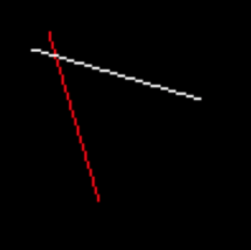
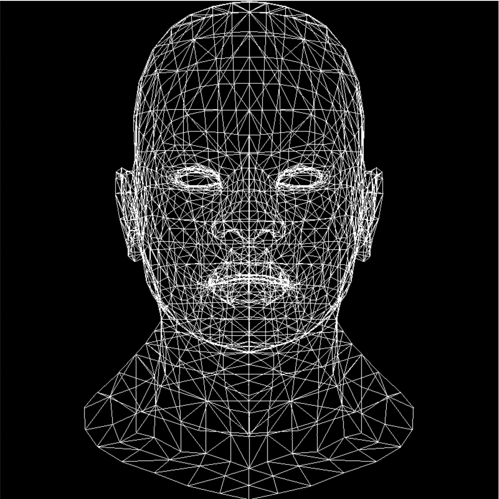
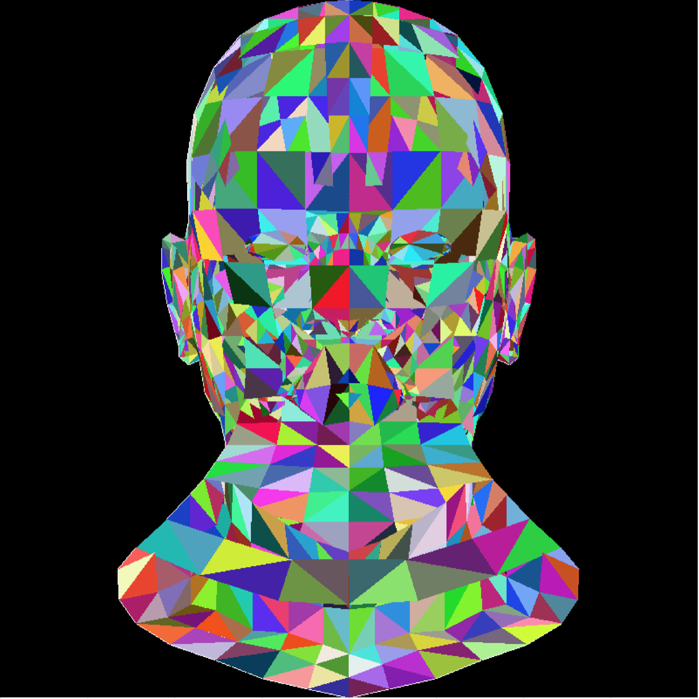
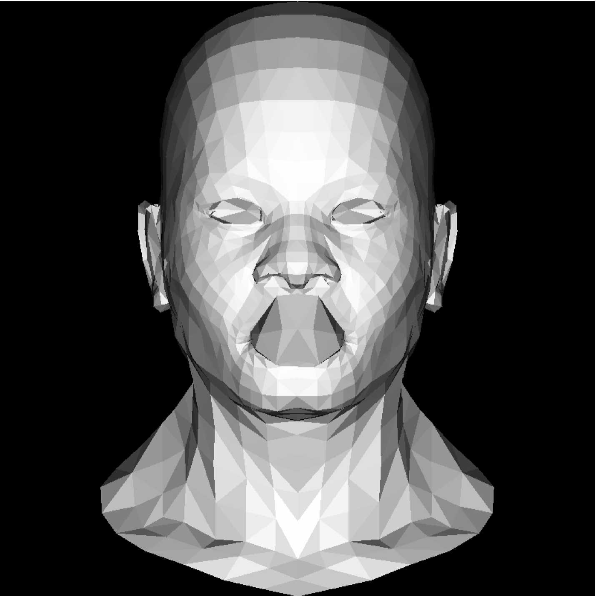
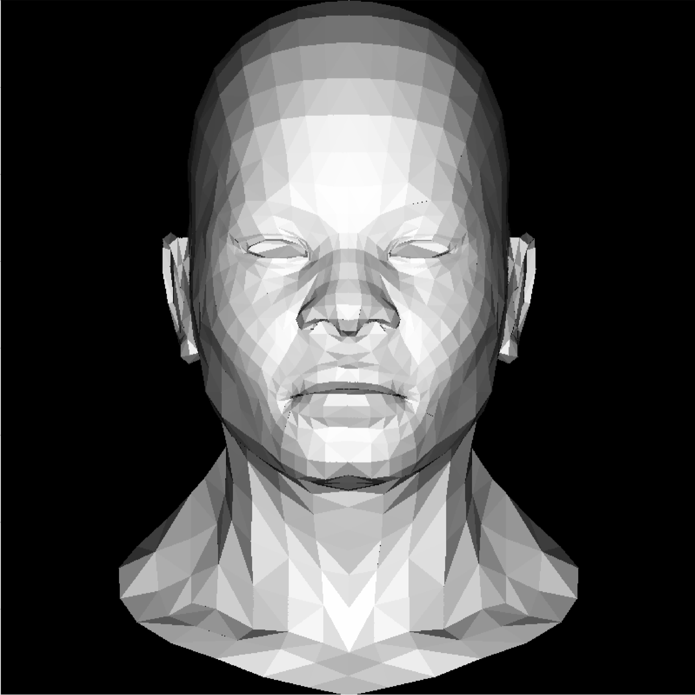
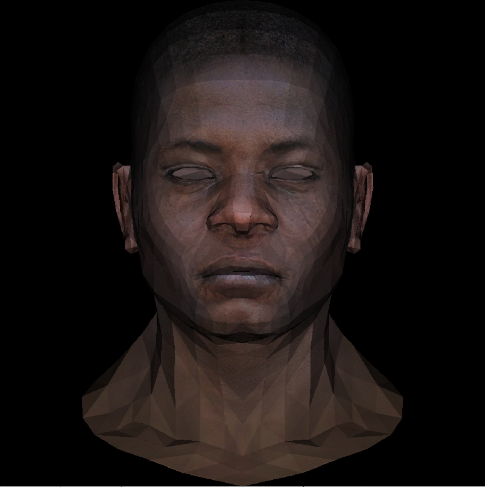
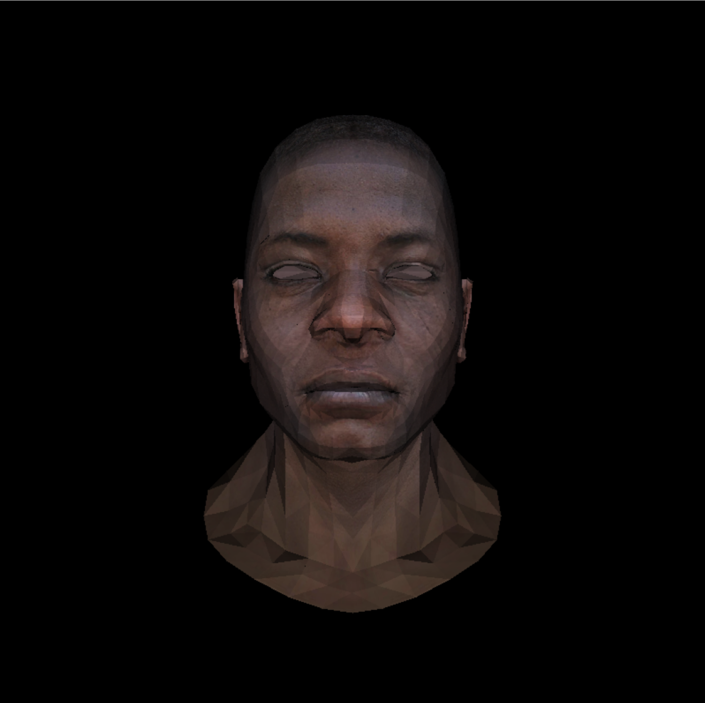
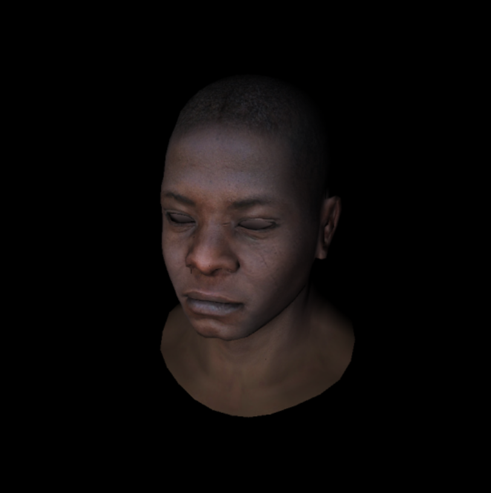
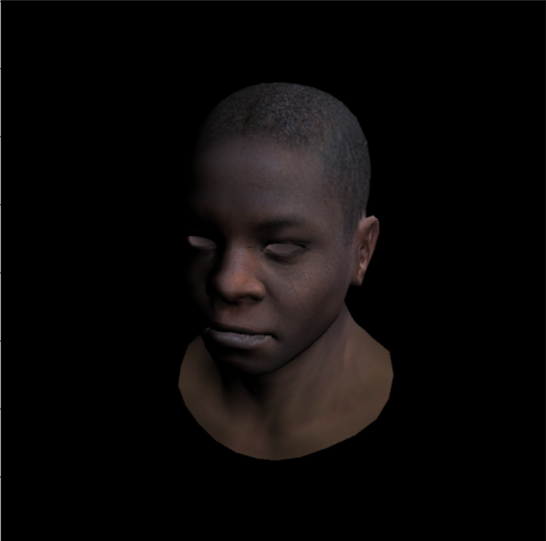
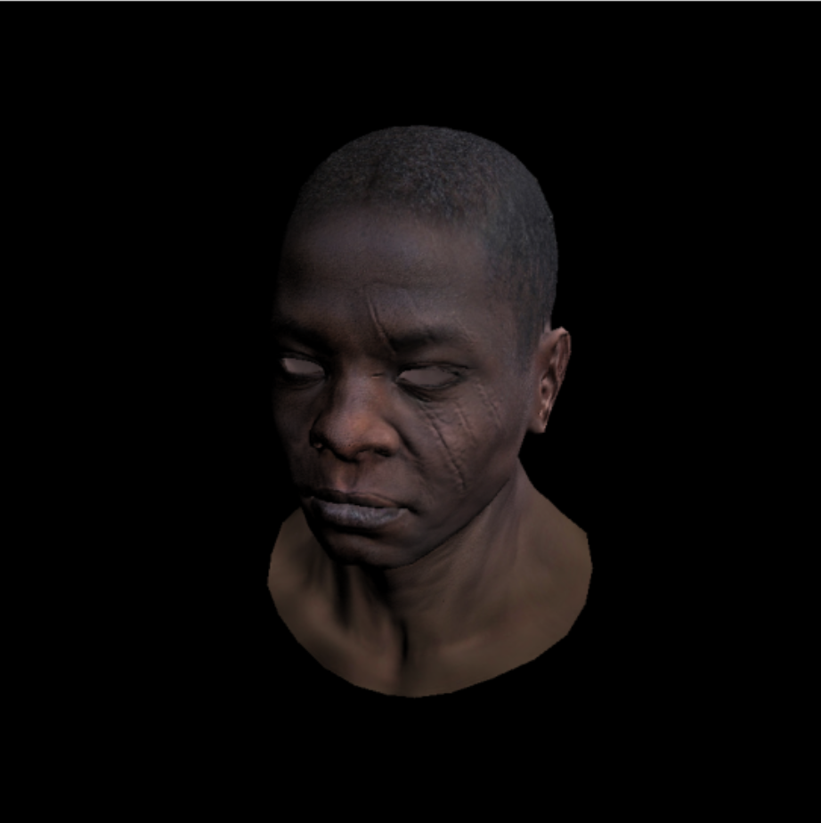

# My tinyrender
My simple implementation of rendering based on [this course](https://github.com/ssloy/tinyrenderer). Unlike it is instructed in the course, I wrote the code in python. But bare python is too slow, so I used numpy to make it faster.

The goal of the learning-project is to be able to render a simple mesh object (given in obj format).
Here is the progress:

1. First of all we need to know how to render simple primitives like a line, (filled) triangle:
   

2. After parsing obj file and applying the methods above we have:

Knowing a triangle normal and light directions we get this (intensity ~ n*l):

Yet there is smth wrong with the mouth.

3. Introducing z-buffer solves the issue:

Changing the gray color on the known texture gives us this:

(wow!)

4. The next step is to take into account that we take an image from a camera. So we need to add perspective projections:

5. While rendering the colored triangles we used barycentric coordinates (to understand if a point is inside a triangle or outside). Actually, they are very useful: knowing color (or anything else) of triangle vertices we can interpolate it all over the triangle (using barycentric coordinates):
   

1. Adding normal and specularity maps. Minor modifications of shader leads to the following results.
   

