# My tinyrender
My simple implementation of rendering based on [this course](https://github.com/ssloy/tinyrenderer) (btw the course is great). Unlike it is instructed in the course, I wrote the code in python. I used numpy to make it faster.

The goal of this project is to learn how to render an object (given in obj format).

Structure:
* lessons1-6.ipynb - prototyping first steps (the code here is a real mess)
* my_render/ - at some point I brushed up the code a bit and made it more structed. So here is more structed version with shader abstraction
* obj/ - .obj .png files of 3d models

Here is my progress:

#### 1. First of all we need to know how to render simple primitives like a line, (filled) triangle:

  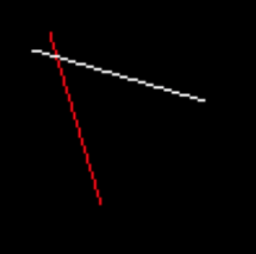
  

#### 2. After parsing obj file and applying the methods above we have:

  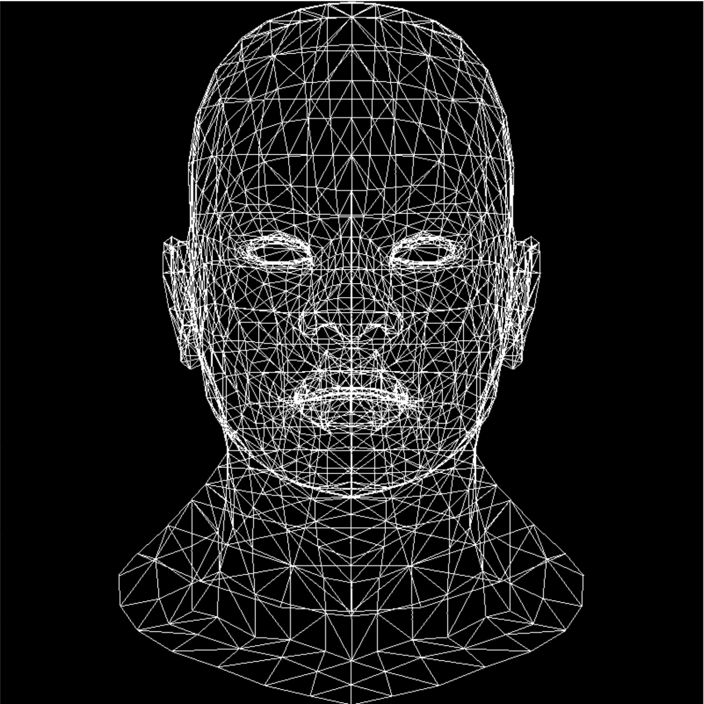
  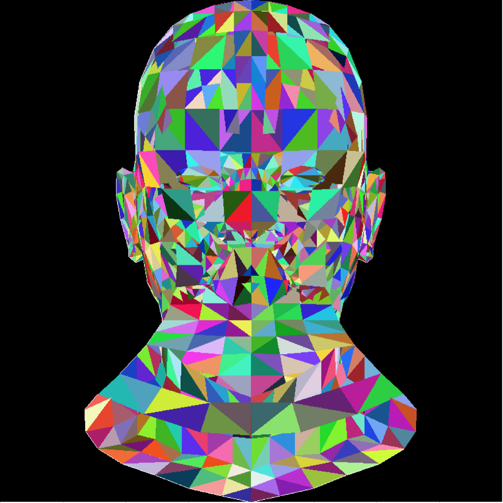

Knowing a triangle normal and light directions we can get this (intensity ~ n*l):

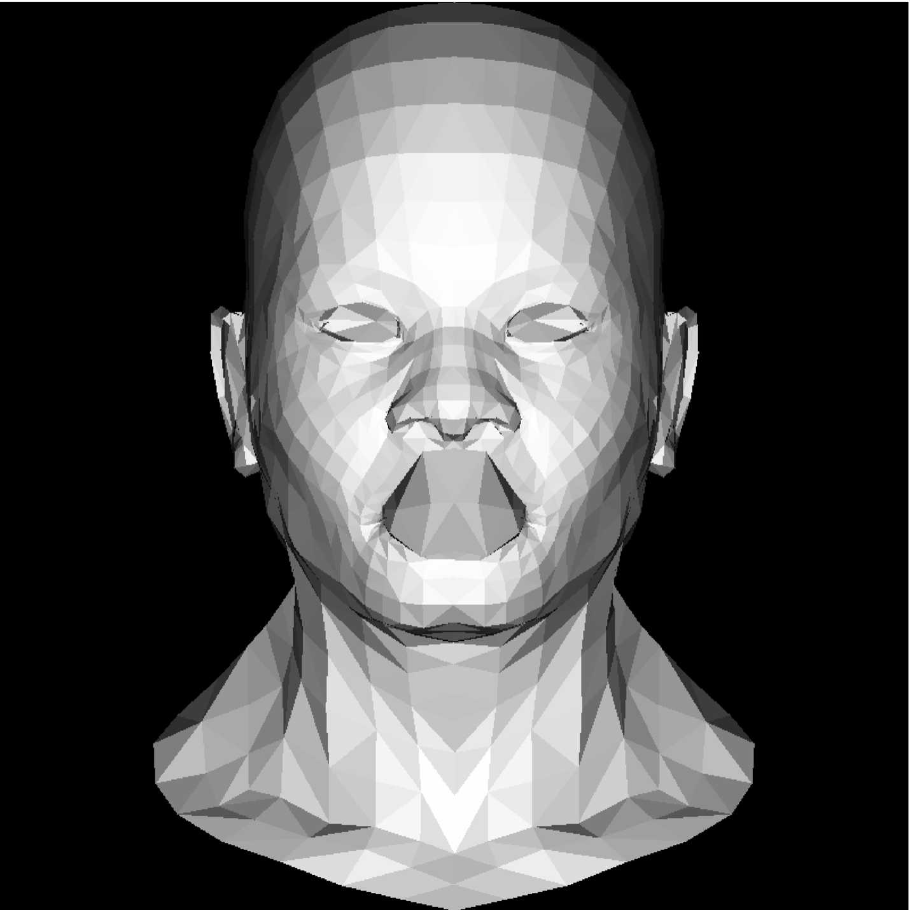

Yet there is smth wrong with the mouth.

#### 3. Introducing z-buffer solves the issue:

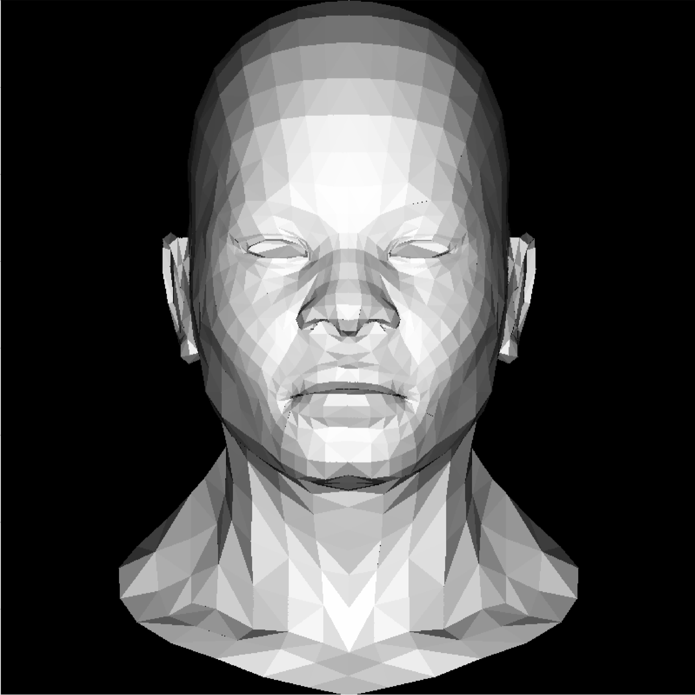

Changing the gray color on the known texture gives us this:

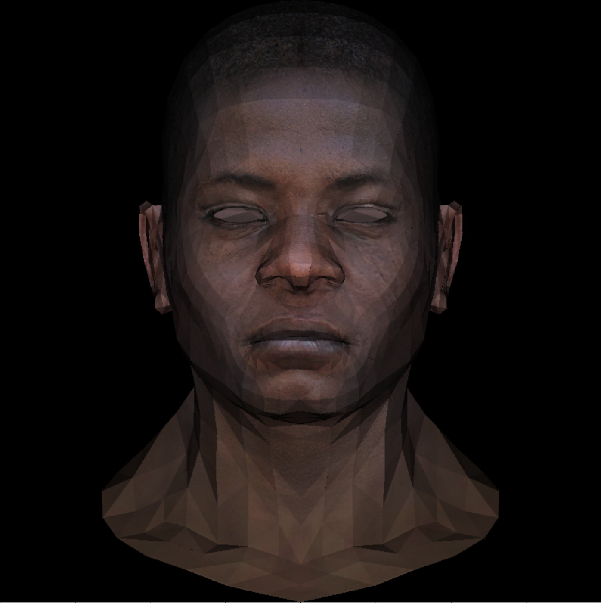

(wow!)

#### 4. The next step is to take into account that we take an image from a camera view. So we need to implement perspective projections:

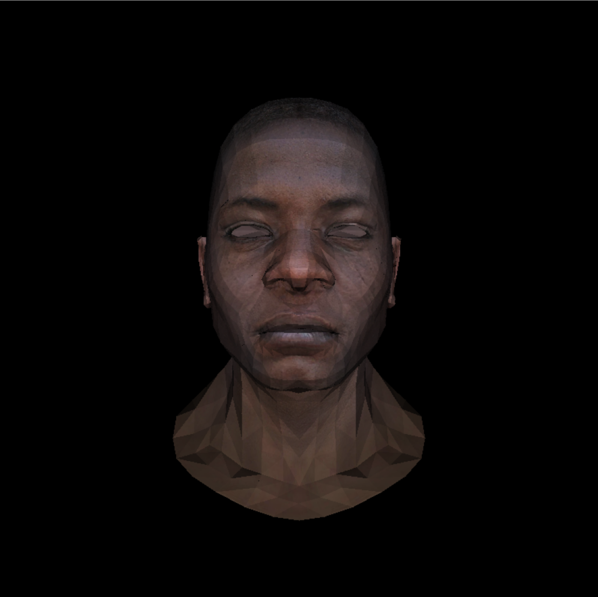

#### 5. While rendering the colored triangles we used barycentric coordinates (to understand if a point is inside a triangle). And here it helps us again: knowing color (or anything else) of triangle vertices we can interpolate it all over the triangle (using the barycentric coordinates):
   
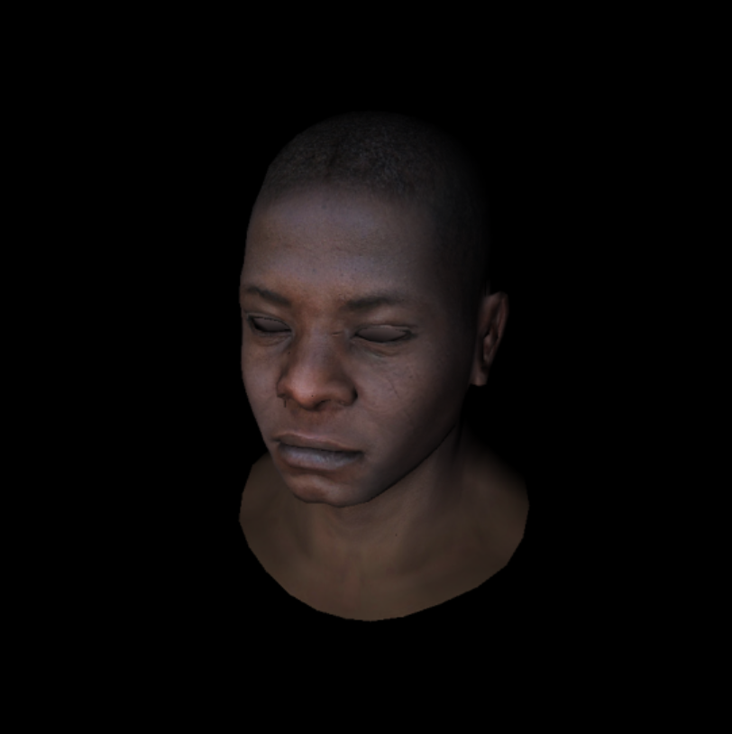

#### 6. Adding normal and specularity maps. Minor modifications of shader leads to the following results.
   

  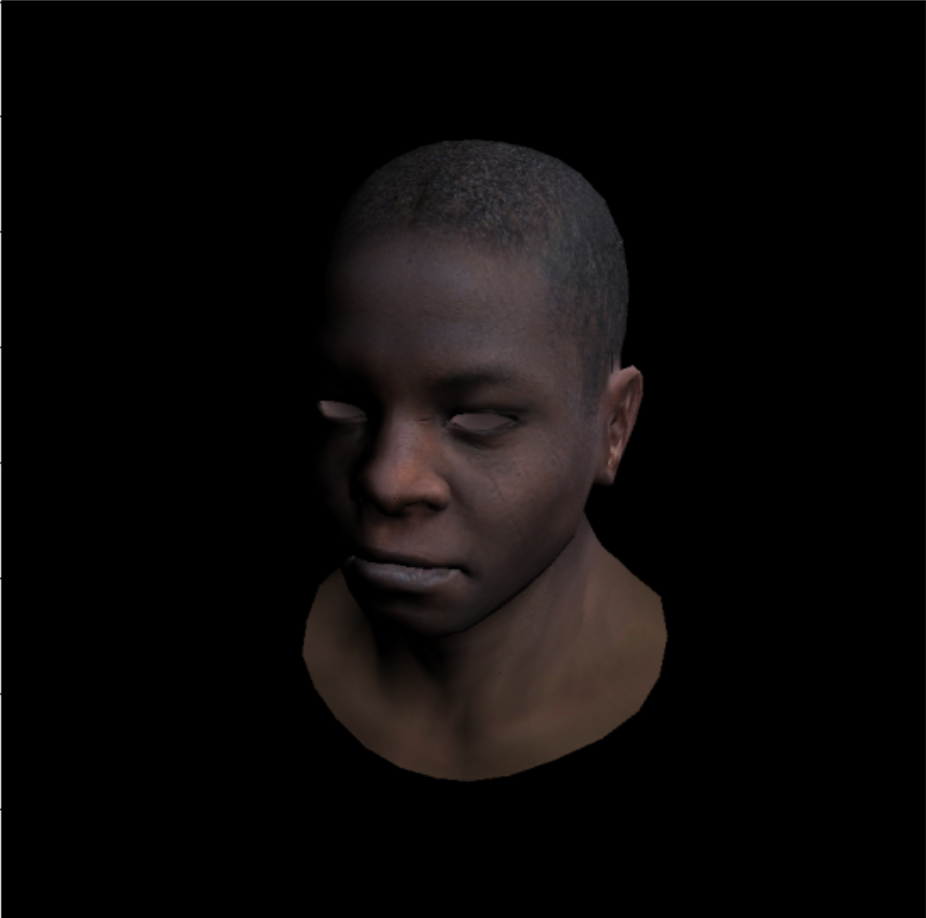
  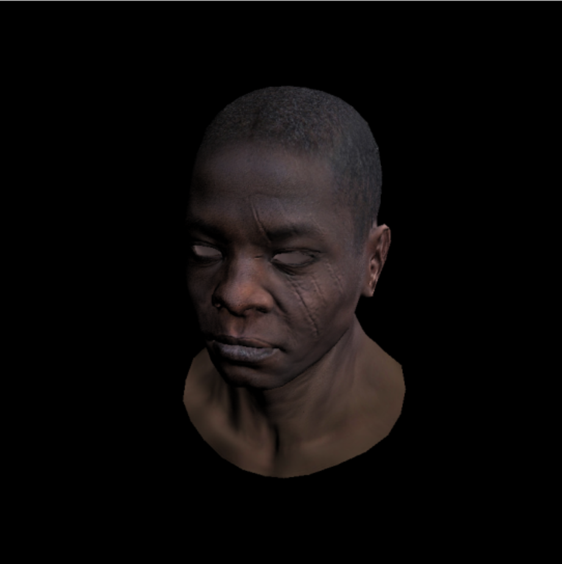
  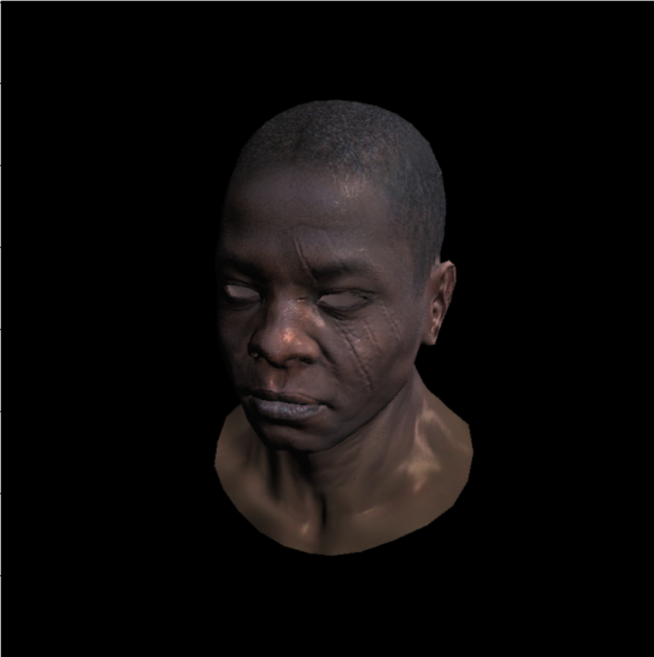

TODO list:
- [x] Bresenham’s Line Drawing Algorithm
- [x] Triangle rasterization and back face culling
- [x] Hidden faces removal (z buffer)
- [x] Perspective projection
- [x] Moving the camera
- [x] Shaders for the software renderer
- [ ] Shadow mapping
- [ ] Ambient occlusion
